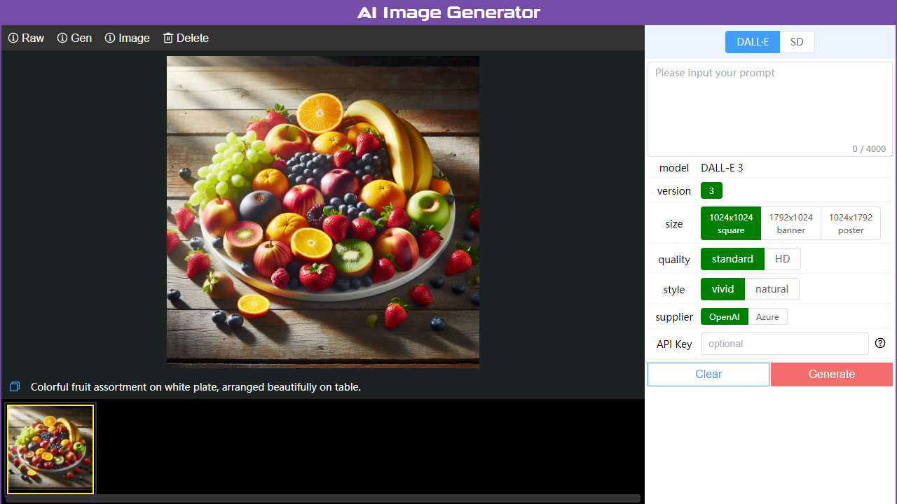

AI Image Generator
================

**[English](./README.md)** | **[中文](./README_zh.md)**

**AI Image Generator** is a easy-to-operate image generator that provides users with a more convenient and efficient image generation solution.  
It is based on **Dall·E** and **Stable Diffusion** API, and implements complete client(vue) and server(tornado) solution.

Screenshots & Demo
----------------




DEMO: [www.ai-img-gen.com/gen-basic/](https://www.ai-img-gen.com/gen-basic/)

How to run it
----------------

Step 1. Install python >= 3.10  
  
Step 2. Install the project's python dependencies

```sh
cd <project_path>
pip install -r server/requirements.txt
```

Step 3. Configure **Dall·E** or **Stable Diffusion** API key

```text
Use text editor to open <project_path>/server/conf.json,
and fill in the "api_key" field by your needs,
remember to save it.
```

Step 4. Start the python server

```sh
cd <project_path>
python server/app.py
```

Step 5. Open browser, visit **<http://127.0.0.1:3001>**

Official site
----------------

* [www.ai-img-gen.com](https://www.ai-img-gen.com/)

Directory Structure
----------------

```text
root
├─ client   // Vue client project
├─ intro    // Related files introduced
├─ server   // Python server project
└─ wwwroot  // Server web root directory / Vue build output directory
```

Others
----------------

***⭐ If you like this project, please add a star ⭐***
