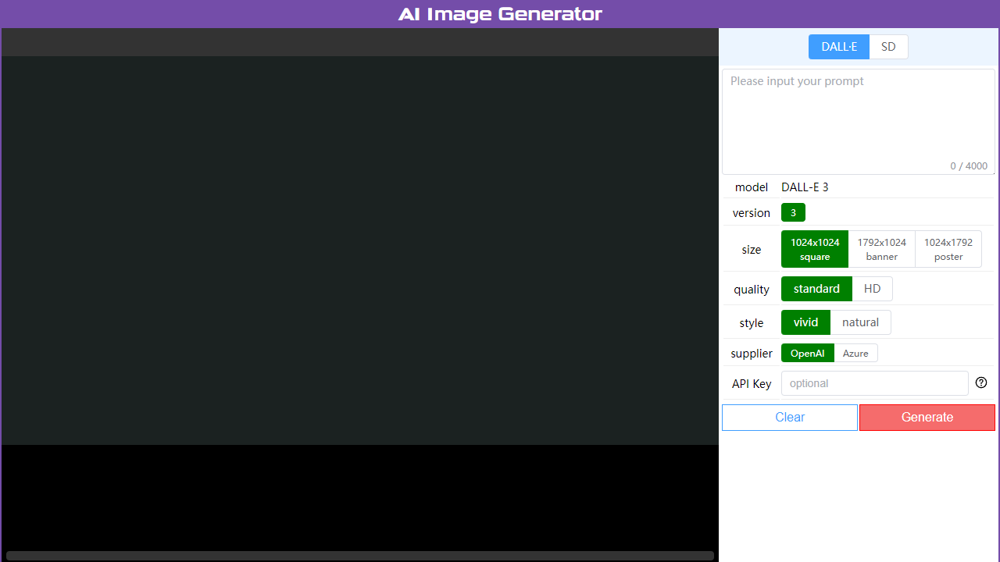
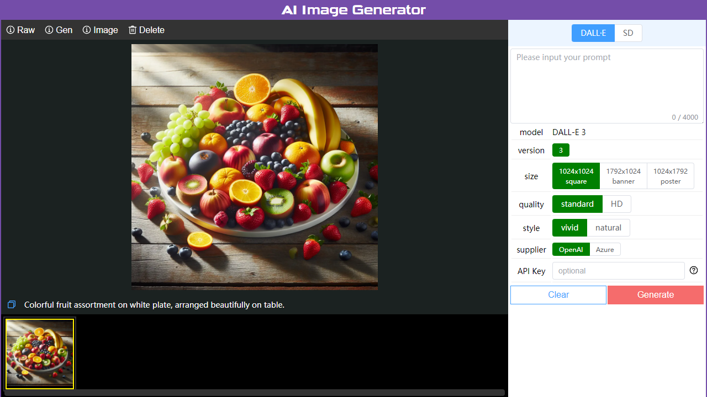

AI图片生成器(AI Image Generator)
================

**[English](./README.md)** | **[中文](./README_zh.md)**

**AI图片生成器**是一款易于操作的图片生成器，为用户提供更加便捷、高效的图片生成解决方案。  
它是基于 **Dall·E** 和 **Stable Diffusion** API，并实现了完整的客户端(vue)和服务器(tornado)的解决方案。

截图与演示
----------------




演示：[www.ai-img-gen.com/gen-basic/](https://www.ai-img-gen.com/gen-basic/)

如何运行它
----------------

步骤1. 安装 python >= 3.10  
  
步骤2. 安装项目的 python 依赖项  

```sh
cd <项目路径>
pip install -r server/requirements.txt
```

步骤3. 配置 **Dall·E** 或 **Stable Diffusion** 的API密钥

```text
使用文本编辑器打开 <项目路径>/server/conf.json，根据需要填写"api_key"字段，记得保存。
```

步骤4. 启动python服务器  

```sh
cd <项目路径>
python server/app.py
```

步骤5. 打开浏览器, 访问 **<http://127.0.0.1:3001>**

官方网站
----------------

* [www.ai-img-gen.com](https://www.ai-img-gen.com/)

目录结构
----------------

```text
root
├─ client   // Vue 客户端项目
├─ intro    // 与介绍相关的文件
├─ server   // Python 服务器项目
└─ wwwroot  // 服务器 Web 根目录 / Vue 构建输出目录
```

其他
----------------

***⭐ 如果您喜欢这个项目，请加一颗星 ⭐***
